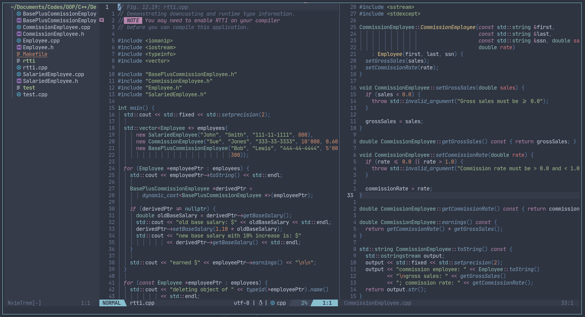

# NEOVIM

<!-- vim-markdown-toc GFM -->

* [How it looks](#how-it-looks)
* [File structure](#file-structure)
* [TODO:](#todo)

<!-- vim-markdown-toc -->

## How it looks

This is my work-in-progress neovim setup configured in/migrated to Lua. It looks like this (with some sample codes from the textbook):



## File structure

This is the current structure of my neovim directory (eliding non-config files). The configuration for the plugins installed is in the `plugins`
folder under `lua` with their respective `cfg-` directories containing init files. Most of the plugins are _plug and play_ and the configurations
copied from their wikis (Also, some of the plugins I may not really need but it's nice to try them out).
Thank you plugin creators for a mostly hassle free neovim setup.

```text
📂  $HOME/.config/nvim
├── 📂 after
│  └── 📂 ftplugin
├── 🌑 init.lua
├── 📂 lua
│  ├── 📂 plugins
│  │  ├── 📂cfg-autopairs
│  │  ├── 📂cfg-comment
│  │  ├── 📂cfg-completion
│  │  ├── 📂cfg-custom
│  │  ├── 📂cfg-dashboard
│  │  ├── 📂cfg-devicons
│  │  ├── 📂cfg-emmet
│  │  ├── 📂cfg-file-explorer
│  │  ├── 📂cfg-formatting
│  │  ├── 📂cfg-gitsigns
│  │  ├── 📂cfg-hex-colors
│  │  ├── 📂cfg-indent-blankline
│  │  ├── 📂cfg-lspconfig
│  │  ├── 📂cfg-md-preview
│  │  ├── 📂cfg-statusline
│  │  ├── 📂cfg-telescope
│  │  ├── 📂cfg-terminal
│  │  ├── 📂cfg-theme
│  │  ├── 📂cfg-tree-sitter
│  │  ├── 📂cfg-vimwiki
│  │  ├── 📂cfg-writing
│  ├── 📂remaps
│  └── 📂settings
```

## TODO:

- [ ] Explore more vim/neovim builtin stuff.
- [ ] Explore telescope builtin functions.
- [ ] Explore tree-sitter capabilities.
- [ ] Explore packer.nvim features.
- [ ] Add more custom functions in `cfg-custom`
- [ ] Add dictionary for my own made up words. LOL!
