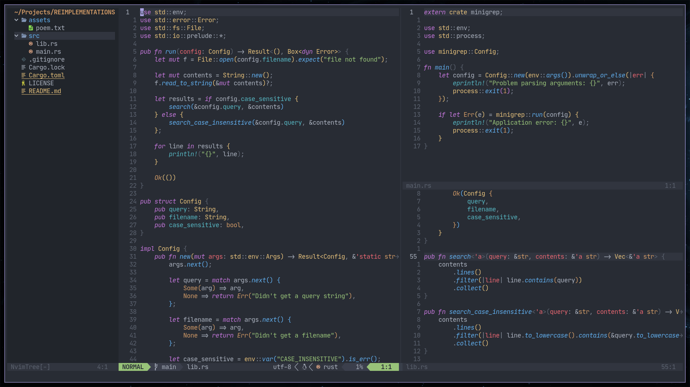

# NEOVIM

<!-- vim-markdown-toc GFM -->

* [Dependencies](#dependencies)
* [How it looks](#how-it-looks)
* [File structure](#file-structure)
* [Credits](#credits)
* [Todo](#todo)
	* [Important](#important)
	* [Miscellaneous](#miscellaneous)

<!-- vim-markdown-toc -->

## Dependencies

This configuration requires `NVIM v0.6.0` (or later version) along with the following
dependencies:

- **utilities**
  - [ripgrep](https://github.com/BurntSushi/ripgrep)
  - [fd](https://github.com/sharkdp/fd)
- **formatters**
  - [black](https://github.com/psf/black)
  - [clang-format](https://clang.llvm.org/docs/ClangFormat.html)
  - [fnlfmt](https://git.sr.ht/~technomancy/fnlfmt)
  - [latexindent](https://github.com/cmhughes/latexindent.pl)
  - [ormolu](https://github.com/tweag/ormolu)
  - [prettier](https://prettier.io/)
  - [rustfmt](https://github.com/rust-lang/rustfmt)
  - [shfmt](https://github.com/mvdan/sh)
  - [stylua](https://github.com/JohnnyMorganz/StyLua)
- **language servers**
  - [arduino language server](https://github.com/arduino/arduino-language-server)
  - [bashls](https://github.com/mads-hartmann/bash-language-server)
  - [clangd](https://clangd.llvm.org/installation.html)
  - [cssls](https://github.com/hrsh7th/vscode-langservers-extracted)
  - [hls](https://github.com/haskell/haskell-language-server)
  - [html](https://github.com/hrsh7th/vscode-langservers-extracted)
  - [pyright](https://github.com/microsoft/pyright)
  - [rust-analyzer](https://github.com/rust-analyzer/rust-analyzer)
  - [sumneko lua](https://github.com/sumneko/lua-language-server)
  - [texlab](https://github.com/latex-lsp/texlab)
  - [tsserver](https://github.com/theia-ide/typescript-language-server)
  - [vimls](https://github.com/iamcco/vim-language-server)

## How it looks

I'm currently using the [onedark](https://github.com/navarasu/onedark.nvim)
theme. Here's how neovim looks with my config with some sample code from the
[Rust book](https://doc.rust-lang.org/book/ch12-00-an-io-project.html):



## File structure

This is the structure of my neovim directory (eliding non-config files). The
configuration for the plugins installed is in the `cfg` directory under `lua`
with their respective `<plugin>/init.lua` files. Most of the plugins are _plug
and play_ and the configurations copied from their wikis.

```text
📂$HOME/.config/nvim
├── 📂after
│ └── 📂ftplugin
├── 🌑 init.lua
├── 📂lua
│ ├── 📂cfg
│ │ ├── 📂autocmds
│ │ ├── 📂autopairs
│ │ ├── 📂barbar
│ │ ├── 📂comment
│ │ ├── 📂completion
│ │ ├── 📂custom
│ │ ├── 📂dashboard
│ │ ├── 📂devicons
│ │ ├── 📂diffview
│ │ ├── 📂filetree
│ │ ├── 📂formatting
│ │ ├── 📂gitsigns
│ │ ├── 📂headlines
│ │ ├── 📂hex-colors
│ │ ├── 📂lspconfig
│ │ ├── 📂md-preview
│ │ ├── 📂neogit
│ │ ├── 📂notify
│ │ ├── 📂statusline
│ │ ├── 📂telescope
│ │ ├── 📂terminal
│ │ ├── 📂theme
│ │ ├── 📂tree-sitter
│ │ ├── 📂vimwiki
│ │ ├── 📂which-key
│ │ └── 📂writing
│ ├── 📂plugins
│ ├── 📂remaps
│ └── 📂settings
```

## Credits

It is thanks to this people's well-written dotfiles and documentations that I
was able to write this configuration:

- [changemewtf](https://github.com/mcantor/no_plugins); especially his talk
  [How to Do 90% of What Plugins Do (With Just
  Vim)](https://www.youtube.com/watch?v=XA2WjJbmmoM&t=372s)
- [mhartington](https://github.com/mhartington)
- [The Primeagen](https://github.com/ThePrimeagen)
- [tjdevries](https://github.com/tjdevries)
- [nanotee (nvim lua guide)](https://github.com/nanotee/nvim-lua-guide)
- [chris@machine](https://github.com/ChristianChiarulli); especially his
  [blogs](https://www.chrisatmachine.com/) and [Youtube
  videos](https://www.youtube.com/channel/UCS97tchJDq17Qms3cux8wcA).
- [Distrotube](https://gitlab.com/dwt1/)
- and many more others I can't remember

## Todo

### Important

- [ ] Maybe uninstall nvim-tree in favor of telescope-file-browser extension?
      (or maybe they solve different problems?)

### Miscellaneous

- [ ] Explore more vim/neovim builtin stuff.
- [x] Explore telescope builtin functions.
- [ ] Explore tree-sitter capabilities.
- [ ] Explore packer.nvim features.
- [ ] Add more custom functions in `cfg/custom`
- [ ] Add dictionary for my own made up words. LOL!
